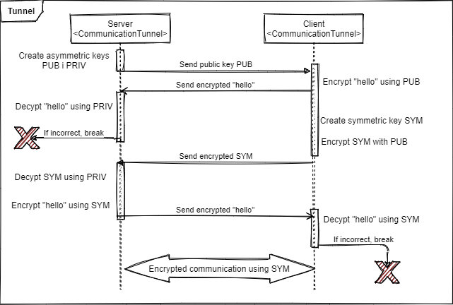
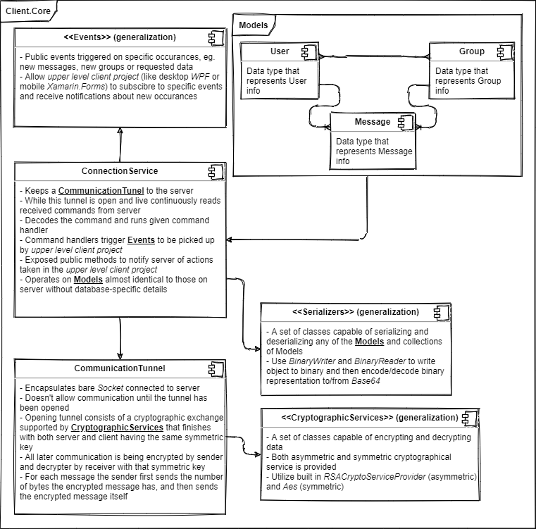

# Slacek

## Chat application using Client-Server architecture and .NET CORE

### Desktop application

Slacek is a desktop and server application that allows users to communicate quickly without unnecessary steps.
It is based around  **Windows Presentation Foundation (WPF)** which allows for unbeatable performance and the best user experience available.
It uses:

- .NET 5.0 (Core)
- Entity Framework (EF) for database

### Server

Slacek provides server that uses a multi-threaded architecture to assure multi user functionality. Slacek was built with **privacy** in mind. It uses two way end-to-end encryption to encrypt **all** communication between Clients and Server.

## How to run?

### Running desktop client

You can either choose to compile the code yourself, or use the release version available in the **Releases** tab.
To compile, please use Microsoft Visual Studio for opening the project, and make sure you choose **Client** project for your startup project or use command:

```sh
dotnet build
```

to build all projects. Please read below to get more information about server building. You may require to install Entity Framework tool.

### Running server

We encourage to build the server via command line.
Firstly make sure you have EF tools available:

```sh
dotnet tool install --global dotnet-ef
```

Then enter the Server directory, and refresh database:

```sh
cd Server
dotnet ef update database
```

And run the server:

```sh
dotnet run
```

## How does it work?


### Privacy

Slacek is built with **privacy** in mind. It uses custom created hybrid encryption type that uses both symmetric and asymmetric encryption to encrypt messages.
When **client** is connecting to the server the server is generating a pair of key: public and a private one.
The client then receives the public one and creates symmetric key. It encrypts the symmetric key using the server's public key.
Server then decrypts that key using the private key and from then both sides have the symmetric key. From then - all communications is being encrypted and decrypted using that key.
This key has never been transferred between client via plain-text.
The authentication process is also being verified at all steps along the way. So if there is a problem, the communication will be terminated.
This logic is handled via CommunicationTunnel.cs.



### Server structure

Server is multi-threaded. Once there is a connection it starts a new thread.
This thread:

- Creates Communication Tunnel,
- Subscribes to NewMessage and NewUserInGroup.
- Handles commands received via Communication Tunnel. (command description available in [protocol.md](protocol.md)).

Server uses models for storing the information in database. It uses Entity Framework 4 which provides ORM for our application.


### Client structure

Client consists of two layers:

The top layer is the frontend, at this time a desktop client is implemented using **WPF** with possible future extension to e.g. mobile using **Xamarin.Forms**.

The lower layer - `Client.Core` - is a .Net Standard 2.1 library, which means it can be used by any .NET environment - desktop, mobile, even IOT.
This layer handles all communication and core logic.
The custom made library implements communication tunnel in the opposite way to the server.



### Models and serializers

Both client and server uses three models:

- User,
- Message,
- Group.

All models have implemented serializers and deserializers.
