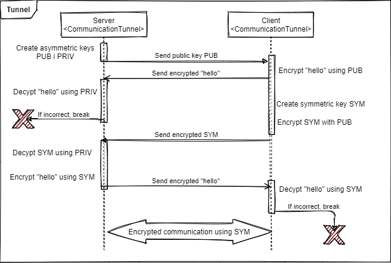

# Communication Protocol

Communication starts with cryptographic [handshake](#Handshake).

Then all following communication is command-based from client to server.
Server replies take header-based structure.
Header based structure:

``` text
method status\r\n
key1: value1\r\n
key2: valye2\r\n
...
```

Available top-level commands:

- [ping](#Ping-command)
- [register](#Register-command)
- [authenticate](#Authenticate-command)
- [unauthenticate](#Unathenticate-command)
- [get](#Get-commands-requesting-data)
- [new](#New-commands-sending-data)
- [join](#Join-command)

## Handshake

Socket connection is automatic and encryption is applied from the very beginning.



## Serialization and encoding

All serialized object mentioned in the protocol are done so in given manner:

The serialization is done by sequentially serializing basic data types using a [BinaryWriter](https://docs.microsoft.com/pl-pl/dotnet/api/system.io.binarywriter?view=netstandard-2.1).
The bare binary data is then converted to base64 string with no newlines.

Additionally some string are **encoded** so to not break with spaces inside them.
The encoding (later called **string-encoding**):

- `String` is converted to binary data through UTF-8 encoding.
- binary data is then encoded to `String` using base 64 conversion

### User serialization

Serialized user consists of serialized:

1. `User.UserId` (`Int32`)
2. `User.Username` (`String`)

in specified order.

### Group serialization

Serialized group consists of serialized:

1. `Group.group-id` (`Int32`)
2. `Group.Name` (`String`)

in specified order.

### Message serialization

Serialized message consists of serialized:

1. `Message.group-id` (`Int32`)
2. `Message.UserId` (`Int32`)
3. `Message.Content` (`String`)

in specified order.

### Collection serialization

Collection serialization is possible to any of previously mentioned class models: `User`, `Group` or `Message` (later called simply a `Model`).

Serialized collection of `Model` type object consists of serialized:

1. `Collection.Count` (`Int32`)
2. [...] `Model` for each `Model` in `Collection.Items`

where every element of the collection is serialized sequentially.

## Health-check

Client can check wether server is live and responding using [ping command](#Ping-command).

### Ping command

**Client sends:**

``` text
ping
```

or

``` text
ping <payload>
```

**Server replies:**

``` text
ping ok\r\n
```

or

``` text
ping ok\r\n
payload: <payload>\r\n
```

Depending on whether the payload was included.

## User authentication

Basic mechanism is implemented to authenticate users.
A user can request authentication (login) with [authenticate command](#Authenticate-command), log out with [unauthenticate command](#Unauthenticate-command) or register with [register command](#Register-command).

Both sides keep track of currently authenticated user in given session.

### Register command

**Client sends:**

``` text
register <login> <encoded-username> <encoded-password>
```

Where `<login>` is plain-text login, `<encoded-username>` is **string-encoded** username, and `<encoded-password>` is **string-encoded** password.

**Server replies:**

If registration was successful:

``` text
register ok\r\n
payload: <serialized-user>\r\n
```

Where `<serialized-user>` is serialized authenticated user object.

Otherwise:

``` text
register err\r\n
```

After registration new user is automatically authenticated.

### Authenticate command

**Client sends:**

``` text
authenticate <login> <encoded-password>
```

Where `<encoded-password>` is **string-encoded** password and `<login>` is plain text login.

**Server replies:**

If authentication was successful:

``` text
authenticate ok\r\n
payload: <serialized-user>\r\n
```

Where `<serialized-user>` is serialized authenticated user object.

Otherwise:

``` text
authenticate err\r\n
```

### Unauthenticate command

**Client sends:**

``` text
unauthenticate
```

Server does not reply.

Both sides change the session state to unauthenticated.

## Get commands (requesting data)

User can request data from server using various `get` commands.

Available `get` commands:

- [`groups`](#Get-groups-command)
- [`users`](#Get-users-command)
- [`messages`](#Get-messages-command)

### Get groups command

**Client sends:**

``` text
get groups
```

**Server replies:**

If request was processed successfully:

``` text
get ok\r\n
resource: groups\r\n
payload: <serialized-groups>\r\n
```

Where `<serialized-groups>` is a serialized collection of groups currently authenticated user is a member of.

Otherwise:

``` text
get err\r\n
```

### Get users command

**Client sends:**

``` text
get users <group-id>
```

Where `<group-id>` is the ID of a group, for which user wants to get members of.

**Server replies:**

If request was processed successfully:

``` text
get ok\r\n
resource: groups\r\n
group-id: <group-id>\r\n
payload: <serialized-users>\r\n
```

Where `<serialized-users>` is a serialized collection of users in group with given `<group-id>`.

Otherwise:

``` text
get err\r\n
```

### Get messages command

**Client sends:**

``` text
get messages <group-id>
```

Where `<group-id>` is the ID of a group, for which user wants to get messages of

**Server replies:**

If request was processed successfully:

``` text
get ok\r\n
resource: messages\r\n
group-id: <group-id>\r\n
payload: <serialized-messages>\r\n
```

Where `<serialized-messages>` is a serialized collection of messages in group with given `<group-id>`.

Otherwise:

``` text
get err\r\n
```

## New commands (sending data)

User can send data to server using various `new` commands.

Available `new` commands:

- [`message`](#New-message-command)
- [`group`](#New-group-command)

### New message command

**Client sends:**

``` text
new message <group-id> <encoded-content>
```

Where `<group-id`> is group identifier which is message destination, `<encoded-content>` is **string-encoded** message content.

Server does not reply to sender, but triggers `NewMessageEvent`, which then distributes this new message to all other connected clients in the group of this message.

### New group command

**Client sends:**

``` text
new group <encoded-name>
```

Where `<encoded-name>` is **string-encoded** name of the new group .

**Server replies:**

If request was processed successfully:

``` text
new ok\e\n
resource: group\r\n
group: <serialized-group>\r\n
```

Where `<serialized-group>` is serialized created group object.

Otherwise:

``` text
new err\r\n
```

## Other

Miscellaneous command, as for [`joining`](#Join-command) a group.

### Join command

When client wants to join an existing group, he sends this command.

**Client sends:**

``` text
join <encoded-name>
```

Where `<encoded-name>` is **string-encoded** name of the group to join.

**Server replies:**

If request was processed successfully:

``` text
join ok\r\n
group: <serialized-group>\r\n
```

Where `<serialized-group>` is serialized group which has been joined.

Otherwise:

``` text
join err\r\n
```

## Server notifications

Most actions are initiated by the client, but occasionally server needs to notify clients too.

The notification's structure is as follows:

``` text
notification\r\n
<type>\r\n
<json>\r\n
```

Where `<type>` is the type of notification, and `<json>` is notification content in the `json` format.
Note, that that `<json>` does not need to be in one line, it can be multi-lined.

### Server-side new message notification

Server redistributes a received message to all other clients in message's group by notifying them.

**Server sends:**

``` text
notification\r\n
message\r\n
<json>\r\n
```

Where `<json>` contains:

``` json
{
    "SerializedMessage": "<serialized-message>"
}
```

Where `<serialized-message>` is the serialized message.

### Server-side new user notification

Server notifies all users in a specific group when a new member joins that group.

**Server sends:**

``` text
notification\r\n
user\r\n
<json>\r\n
```

Where `<json>` contains:

``` json
{
    "GroupId": <group-id>,
    "SerializedUser": "<serialized-user>"
}
```

Where `<group-id>` is the ID of the group, to which a new user has joined in and `<serialized-user>` is serialized user that has joined.
